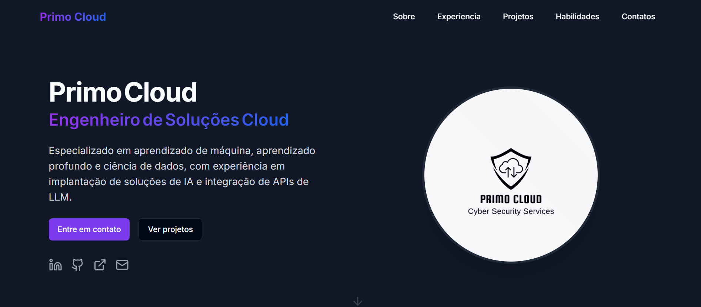

# Primo Cloud
- Criado para ajudar o usuário nas suas necessidades com soluções na nuvem.

## Tecnologias usadas
- nextjs

## Instalação requisitos
- nodejs 18.20
- npm 10.7

 Apos ter instalado pode rodar os comandos abaixo:
  Para instalar as dependencias do projeto rodar o comando:
  - npm install

  Para rodar o projeto local:
  - npm run dev

  